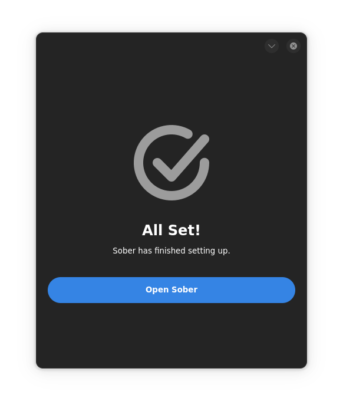

# Installation
---

This is a basic guide on how to install and setup Sober. If you don't know, Sober is as the developers say "...an unofficial port of Roblox to Linux.
No emulators or virtual machines. Up to twice the performance of native Windows" ([Sober Developers](https://sober.vinegarhq.org/)).

## Installing Sober

Sober is pretty easy to install, you will need the following to install and use Sober:

* An x86_64 computer with the SSE4.2 instruction set or higher. (CPU for 2013+ should be fine)
* A modern Linux distribution (Ex: Ubuntu 24.04, Fedora 40, Linux Mint 21)
* A Vulkan 1.1+ capable graphics card, check [FAQ](../docs/FAQ.html) for more info.
* Flatpak installed on your system.

>  If you don't have Flatpak installed on your system, you can install it by going to https://flatpak.org/setup/ and following the guide there for the installation of Flatpak.

Once you have Flatpak installed on your system, you can either download the Flatpak link for your software center [here](https://sober.vinegarhq.org/sober.flatpakref), or in your terminal, run:

``` bash
flatpak install --user https://sober.vinegarhq.org/sober.flatpakref

```

Then in it should appear in your app grid on Gnome or your Application Launcher on KDE/Cinnamon. Open it up and if everything works out, you should see something like this after it completes installing Roblox



Once you click `Open Sober`, everything should just work! If you have any issues, refer to [FAQ](../docs/FAQ.html) or the [list of common issues](../docs/CommonIssues.html) for help, or join the VinegarHQ Discord server [here](https://discord.gg/vinegarhq-1069506340973707304) for more specific issues.

---

## Post-Install

Like the official Roblox client, there really isn't anything that you can configure by default outside of the app. But the [tips](../docs/Tips.html) page is here to help you with some helpful things you might want such as FFlags or bringing the old Oof sound back.

---